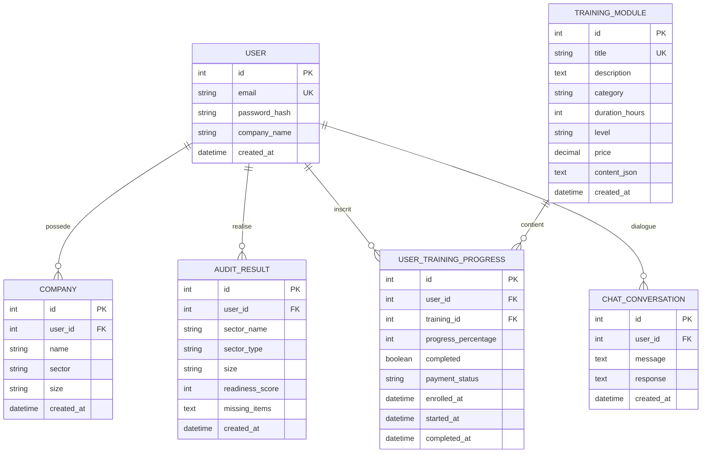

# Modèle Conceptuel de Données (MCD) et Modèle Logique de Données (MLD)
# Cyber Solution Platform

## MCD - Modèle Conceptuel de Données



## MLD - Modèle Logique de Données

### Table: users
| Colonne | Type | Contraintes | Description |
|---------|------|-------------|-------------|
| **id** | INTEGER | PRIMARY KEY AUTOINCREMENT | Identifiant unique |
| **email** | VARCHAR(255) | UNIQUE NOT NULL | Email de connexion |
| **password_hash** | VARCHAR(255) | NOT NULL | Hash bcrypt du mot de passe |
| **company_name** | VARCHAR(255) | NOT NULL | Nom de l'entreprise |
| **created_at** | TIMESTAMP | DEFAULT CURRENT_TIMESTAMP | Date de création du compte |

**Index:**
- UNIQUE INDEX idx_users_email ON users(email)

**Relations:**
- 1 user → N companies (user_id)
- 1 user → N audit_results (user_id)
- 1 user → N user_training_progress (user_id)
- 1 user → N chat_conversations (user_id)

---

### Table: companies
| Colonne | Type | Contraintes | Description |
|---------|------|-------------|-------------|
| **id** | INTEGER | PRIMARY KEY AUTOINCREMENT | Identifiant unique |
| **user_id** | INTEGER | FOREIGN KEY(users.id) NOT NULL | Référence utilisateur |
| **name** | VARCHAR(255) | NOT NULL | Nom commercial |
| **sector** | VARCHAR(100) | NOT NULL | Secteur d'activité |
| **size** | VARCHAR(50) | NOT NULL | Taille (Micro/PME/Grande) |
| **created_at** | TIMESTAMP | DEFAULT CURRENT_TIMESTAMP | Date de création |

**Index:**
- INDEX idx_companies_user ON companies(user_id)

---

### Table: audit_results
| Colonne | Type | Contraintes | Description |
|---------|------|-------------|-------------|
| **id** | INTEGER | PRIMARY KEY AUTOINCREMENT | Identifiant unique |
| **user_id** | INTEGER | FOREIGN KEY(users.id) NOT NULL | Référence utilisateur |
| **sector_name** | VARCHAR(100) | NOT NULL | Secteur audité |
| **sector_type** | VARCHAR(50) | NOT NULL | Type (critical/important/excluded) |
| **size** | VARCHAR(50) | NOT NULL | Taille entreprise |
| **readiness_score** | INTEGER | NOT NULL CHECK(>=0 AND <=100) | Score de conformité (0-100) |
| **missing_items** | TEXT | | Items manquants (JSON) |
| **created_at** | TIMESTAMP | DEFAULT CURRENT_TIMESTAMP | Date de l'audit |

**Index:**
- INDEX idx_audit_user_date ON audit_results(user_id, created_at DESC)

**Business Rules:**
- readiness_score ∈ [0, 100]
- sector_type ∈ {'critical', 'important', 'excluded'}
- size ∈ {'Micro', 'PME', 'Grande'}

---

### Table: training_modules
| Colonne | Type | Contraintes | Description |
|---------|------|-------------|-------------|
| **id** | INTEGER | PRIMARY KEY AUTOINCREMENT | Identifiant unique |
| **title** | VARCHAR(255) | UNIQUE NOT NULL | Titre de la formation |
| **description** | TEXT | NOT NULL | Description détaillée |
| **category** | VARCHAR(100) | NOT NULL | Catégorie (NIS2/RGPD/Cybersécurité) |
| **duration_hours** | INTEGER | NOT NULL | Durée en heures |
| **level** | VARCHAR(50) | NOT NULL | Niveau (Débutant/Intermédiaire/Avancé) |
| **price** | DECIMAL(10,2) | NOT NULL CHECK(>=0) | Prix en euros |
| **content** | TEXT | NOT NULL | Contenu JSON (modules, quiz) |
| **created_at** | TIMESTAMP | DEFAULT CURRENT_TIMESTAMP | Date de création |

**Index:**
- UNIQUE INDEX idx_training_title ON training_modules(title)
- INDEX idx_training_category ON training_modules(category)

**Data Format (content):**
```json
{
  "modules": [
    {
      "title": "Module 1",
      "duration": "15 min",
      "lessons": [
        {"title": "Leçon 1", "content": "..."},
        {"title": "Leçon 2", "content": "..."}
      ]
    }
  ],
  "quiz": [
    {
      "question": "Question?",
      "options": ["A", "B", "C", "D"],
      "correct": 0
    }
  ]
}
```

---

### Table: user_training_progress
| Colonne | Type | Contraintes | Description |
|---------|------|-------------|-------------|
| **id** | INTEGER | PRIMARY KEY AUTOINCREMENT | Identifiant unique |
| **user_id** | INTEGER | FOREIGN KEY(users.id) NOT NULL | Référence utilisateur |
| **training_id** | INTEGER | FOREIGN KEY(training_modules.id) NOT NULL | Référence formation |
| **progress** | INTEGER | DEFAULT 0 CHECK(>=0 AND <=100) | Progression (0-100%) |
| **completed** | BOOLEAN | DEFAULT FALSE | Formation terminée |
| **payment_status** | VARCHAR(50) | DEFAULT 'pending' | Statut paiement |
| **enrolled_at** | TIMESTAMP | DEFAULT CURRENT_TIMESTAMP | Date d'inscription |
| **started_at** | TIMESTAMP | | Date de début |
| **completed_at** | TIMESTAMP | | Date de complétion |

**Index:**
- UNIQUE INDEX idx_user_training ON user_training_progress(user_id, training_id)
- INDEX idx_progress_status ON user_training_progress(payment_status)

**Business Rules:**
- progress ∈ [0, 100]
- payment_status ∈ {'pending', 'paid', 'failed', 'refunded'}
- CONSTRAINT: started_at >= enrolled_at
- CONSTRAINT: completed_at >= started_at
- CONSTRAINT: completed = TRUE ⟹ progress = 100

---

### Table: chat_conversations
| Colonne | Type | Contraintes | Description |
|---------|------|-------------|-------------|
| **id** | INTEGER | PRIMARY KEY AUTOINCREMENT | Identifiant unique |
| **user_id** | INTEGER | FOREIGN KEY(users.id) NOT NULL | Référence utilisateur |
| **message** | TEXT | NOT NULL | Message utilisateur |
| **response** | TEXT | NOT NULL | Réponse IA |
| **created_at** | TIMESTAMP | DEFAULT CURRENT_TIMESTAMP | Date de l'échange |

**Index:**
- INDEX idx_chat_user_date ON chat_conversations(user_id, created_at DESC)

---

## Schéma Relationnel Normalisé

**Forme Normale de Boyce-Codd (BCNF):**

1. **users** (<u>id</u>, email, password_hash, company_name, created_at)
   - Clé primaire: id
   - Clé candidate: email
   - Dépendances: id → {email, password_hash, company_name, created_at}

2. **companies** (<u>id</u>, #user_id, name, sector, size, created_at)
   - Clé primaire: id
   - Clé étrangère: user_id → users(id)
   - Dépendances: id → {user_id, name, sector, size, created_at}

3. **audit_results** (<u>id</u>, #user_id, sector_name, sector_type, size, readiness_score, missing_items, created_at)
   - Clé primaire: id
   - Clé étrangère: user_id → users(id)
   - Dépendances: id → {user_id, sector_name, sector_type, size, readiness_score, missing_items, created_at}

4. **training_modules** (<u>id</u>, title, description, category, duration_hours, level, price, content, created_at)
   - Clé primaire: id
   - Clé candidate: title
   - Dépendances: id → {title, description, category, duration_hours, level, price, content, created_at}

5. **user_training_progress** (<u>id</u>, #user_id, #training_id, progress, completed, payment_status, enrolled_at, started_at, completed_at)
   - Clé primaire: id
   - Clés étrangères: user_id → users(id), training_id → training_modules(id)
   - Clé candidate: (user_id, training_id)
   - Dépendances: id → {user_id, training_id, progress, completed, payment_status, enrolled_at, started_at, completed_at}

6. **chat_conversations** (<u>id</u>, #user_id, message, response, created_at)
   - Clé primaire: id
   - Clé étrangère: user_id → users(id)
   - Dépendances: id → {user_id, message, response, created_at}

**Toutes les tables sont en BCNF car:**
- Aucune dépendance transitive
- Toutes les dépendances fonctionnelles ont la clé primaire comme déterminant
- Pas de redondance des données

---

## Diagramme des Cardinalités

```
USER (1,1) ──possède──> (0,N) COMPANY
     (1,1) ──réalise──> (0,N) AUDIT_RESULT
     (1,1) ──inscrit──> (0,N) USER_TRAINING_PROGRESS
     (1,1) ──dialogue─> (0,N) CHAT_CONVERSATION

TRAINING_MODULE (1,1) ──contient──> (0,N) USER_TRAINING_PROGRESS
```

**Règles de Gestion:**
1. Un utilisateur peut posséder 0 ou plusieurs entreprises (historique)
2. Un utilisateur peut réaliser 0 ou plusieurs audits
3. Un utilisateur peut s'inscrire à 0 ou plusieurs formations
4. Une formation peut avoir 0 ou plusieurs inscriptions
5. Une inscription concerne 1 seul utilisateur et 1 seule formation
6. Un utilisateur peut avoir 0 ou plusieurs conversations avec le chatbot

---

## Contraintes d'Intégrité

### Contraintes Référentielles
```sql
-- Companies
FOREIGN KEY (user_id) REFERENCES users(id) ON DELETE CASCADE

-- Audit Results
FOREIGN KEY (user_id) REFERENCES users(id) ON DELETE CASCADE

-- User Training Progress
FOREIGN KEY (user_id) REFERENCES users(id) ON DELETE CASCADE
FOREIGN KEY (training_id) REFERENCES training_modules(id) ON DELETE CASCADE

-- Chat Conversations
FOREIGN KEY (user_id) REFERENCES users(id) ON DELETE CASCADE
```

### Contraintes de Domaine
```sql
-- audit_results
CHECK (readiness_score >= 0 AND readiness_score <= 100)
CHECK (sector_type IN ('critical', 'important', 'excluded'))
CHECK (size IN ('Micro', 'PME', 'Grande'))

-- training_modules
CHECK (price >= 0)
CHECK (duration_hours > 0)
CHECK (level IN ('Débutant', 'Intermédiaire', 'Avancé'))

-- user_training_progress
CHECK (progress >= 0 AND progress <= 100)
CHECK (payment_status IN ('pending', 'paid', 'failed', 'refunded'))
```

### Contraintes Métier
```sql
-- La date de début doit être après l'inscription
CHECK (started_at IS NULL OR started_at >= enrolled_at)

-- La date de complétion doit être après le début
CHECK (completed_at IS NULL OR completed_at >= started_at)

-- Si completed = TRUE, alors progress = 100
CHECK (completed = FALSE OR progress = 100)

-- Un utilisateur ne peut pas s'inscrire deux fois à la même formation
UNIQUE (user_id, training_id)
```

---

## Volumétrie Estimée (3 ans)

| Table | Estimations | Croissance | Volume Total |
|-------|-------------|------------|--------------|
| **users** | 100-500 utilisateurs | +150/an | 500 lignes |
| **companies** | 1-2 par user | +200/an | 800 lignes |
| **audit_results** | 5 audits/user/an | +750/an | 2500 lignes |
| **training_modules** | 10-20 formations | +5/an | 25 lignes |
| **user_training_progress** | 2 formations/user | +300/an | 1000 lignes |
| **chat_conversations** | 10 messages/user/an | +1500/an | 5000 lignes |

**Total estimé:** ~10 000 lignes sur 3 ans
**Taille BDD:** ~50 MB (avec contenu JSON des formations)

---

## Optimisations Prévues

### Index Recommandés
```sql
-- Performance des requêtes de dashboard
CREATE INDEX idx_audit_user_date ON audit_results(user_id, created_at DESC);

-- Performance des requêtes de formations
CREATE INDEX idx_progress_paid ON user_training_progress(user_id) 
    WHERE payment_status = 'paid';

-- Performance du chatbot
CREATE INDEX idx_chat_recent ON chat_conversations(user_id, created_at DESC);
```

### Requêtes Fréquentes Optimisées
1. **Dashboard Stats:** Agrégation sur audit_results (index sur user_id)
2. **Formations Actives:** Jointure users + user_training_progress (index composite)
3. **Historique Chat:** Pagination sur chat_conversations (index sur created_at)
