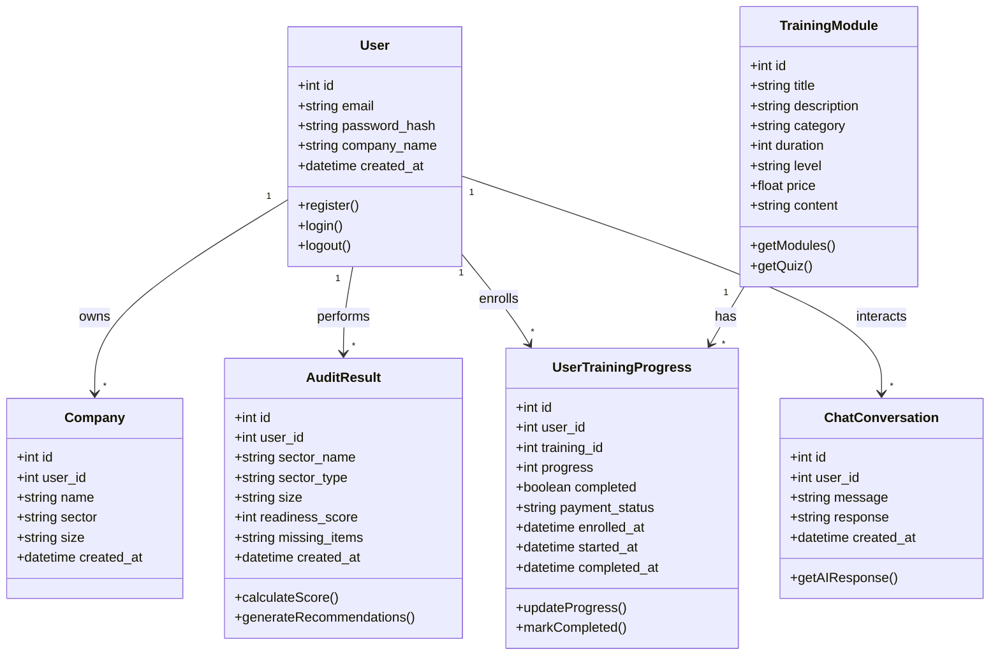
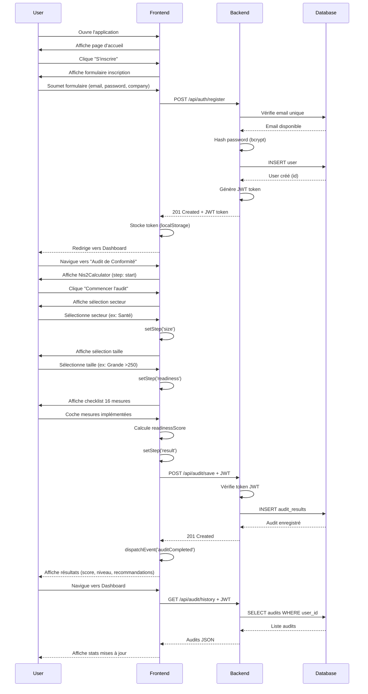
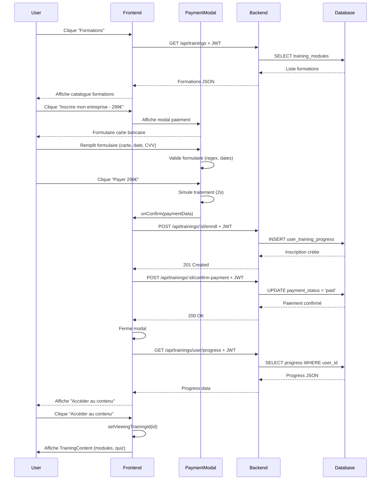
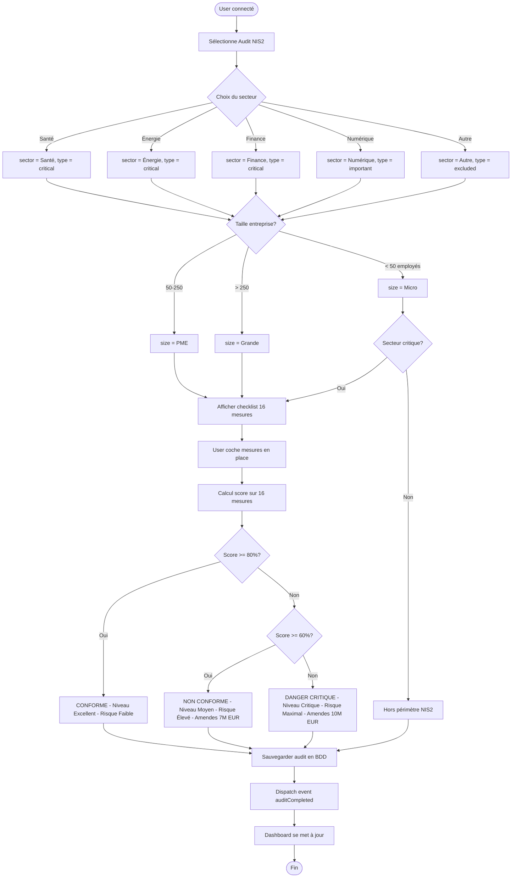
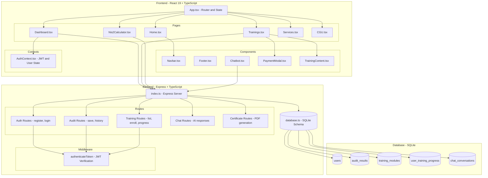
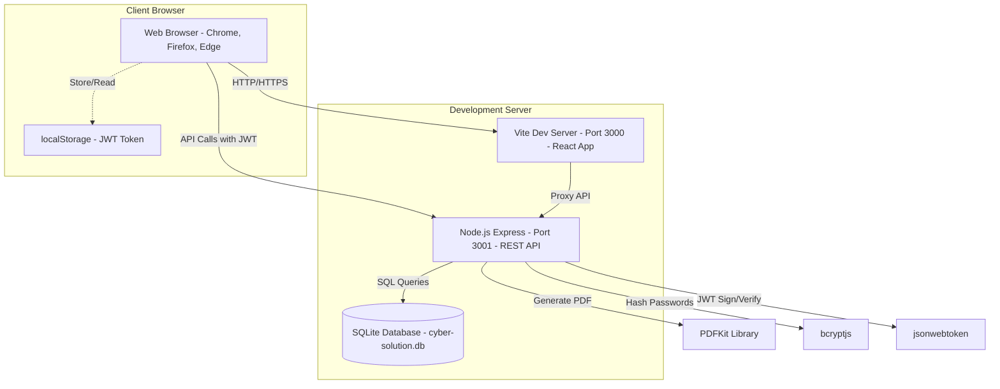

# Architecture UML - Cyber Solution

## Diagramme de Classes

## Diagramme de Séquence - Inscription et Audit

## Diagramme de Séquence - Inscription Formation avec Paiement

## Diagramme d'Activité - Workflow Audit NIS2

## Diagramme de Composants

## Diagramme de Déploiement

