# Wireframes Mermaid - Cyber Solution Platform

Ce fichier contient les wireframes sous forme de diagrammes Mermaid interactifs pour une meilleure visualisation.

## Navigation Globale

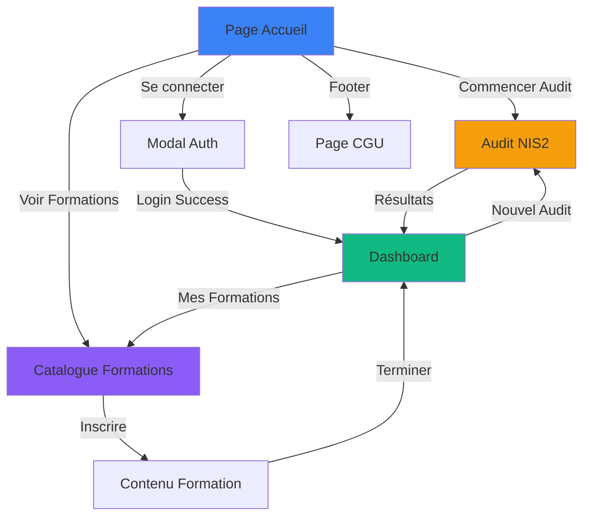

---

## Flow Audit NIS2

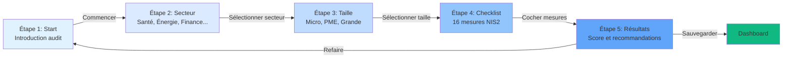

---

## Structure Page Accueil

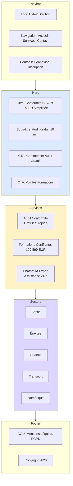

---

## Structure Dashboard

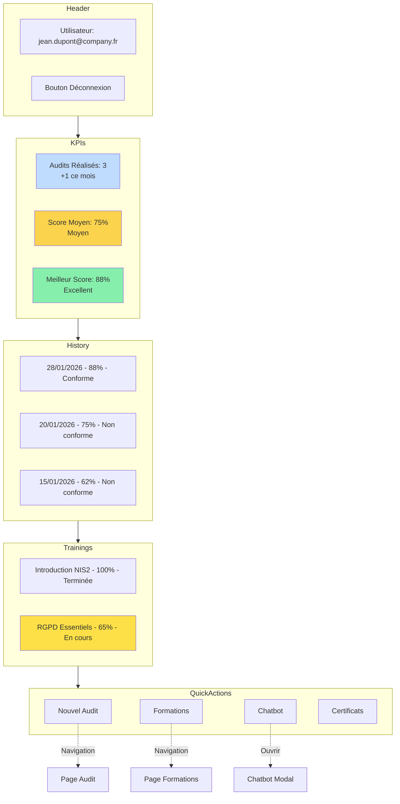

---

## Flow Authentification

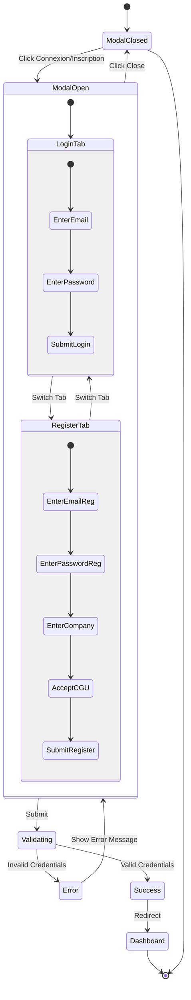

---

## Structure Checklist Audit (Étape 4)

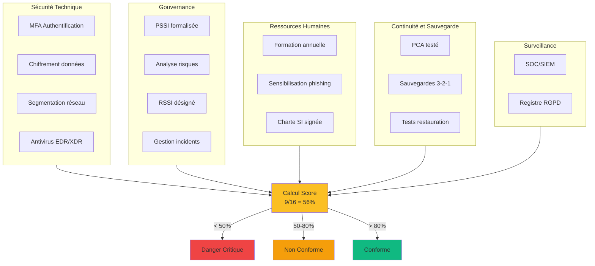

---

## Flow Formation avec Paiement

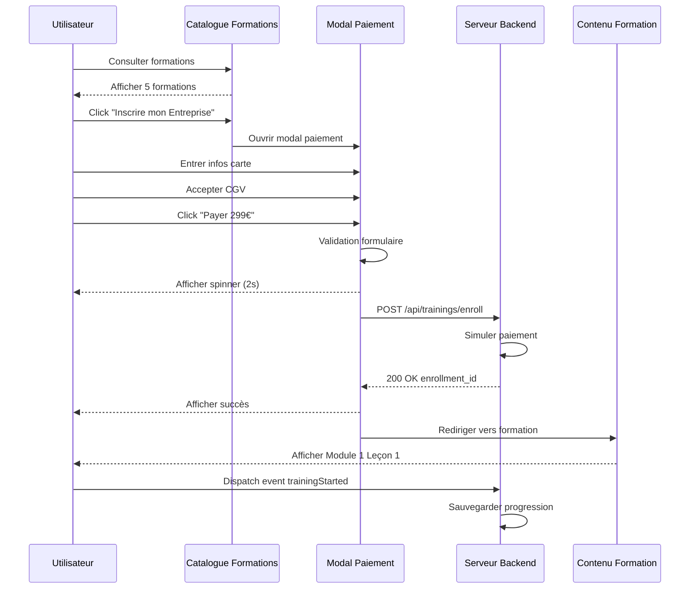

---

## Structure Contenu Formation

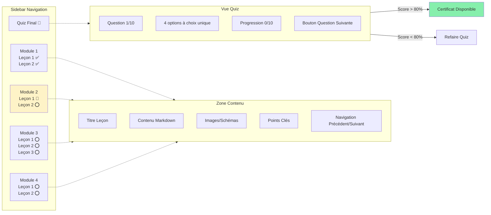

---

## Flow Chatbot

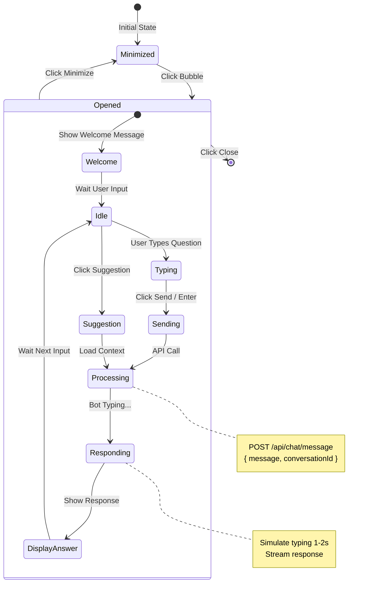

---

## Architecture Responsive

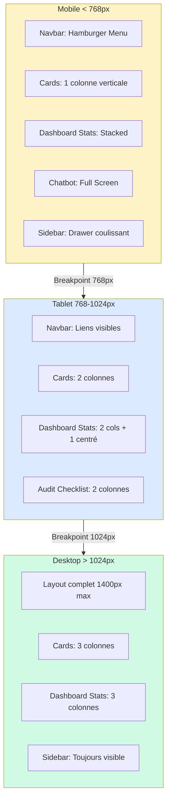

---

## États Modal Paiement

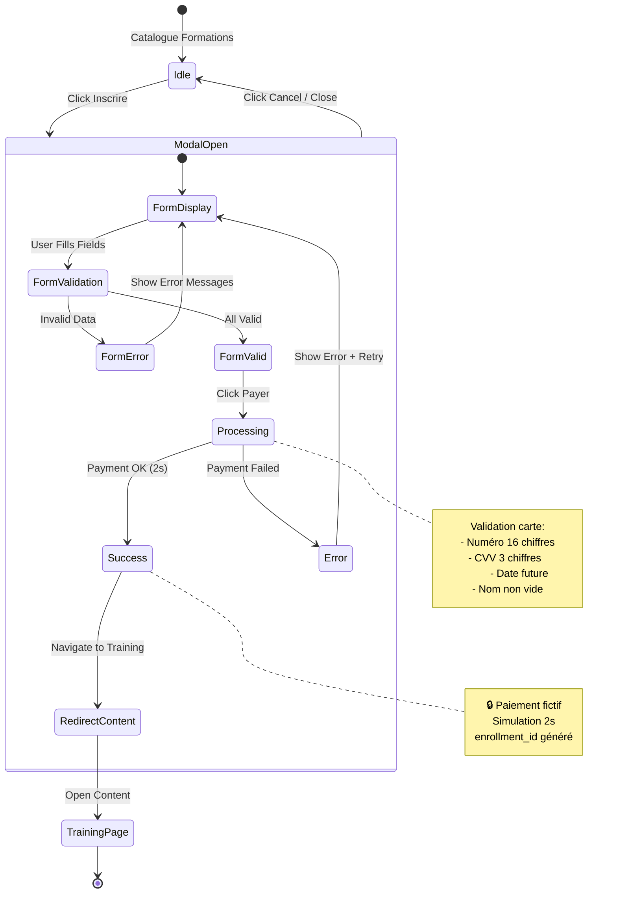

---

## Composants Palette Couleurs

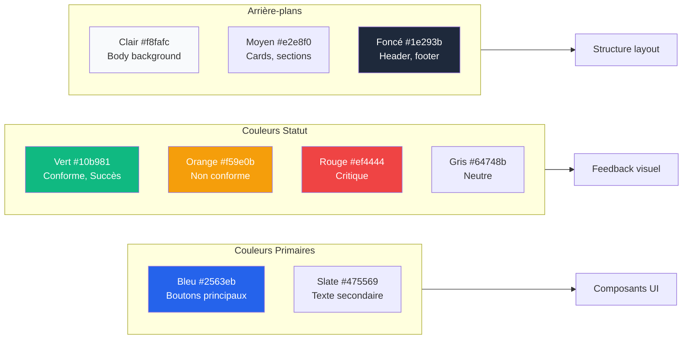

---

## Hiérarchie Typographie

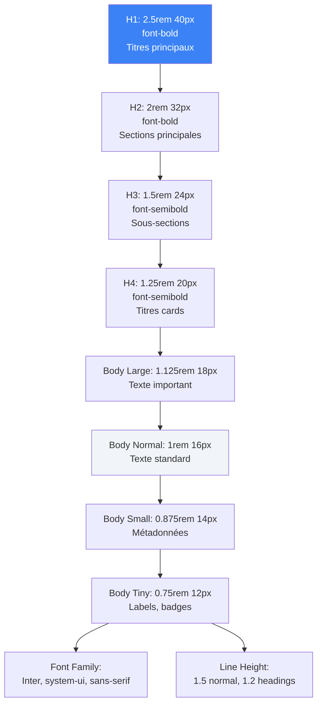

---

## Interactions Animations

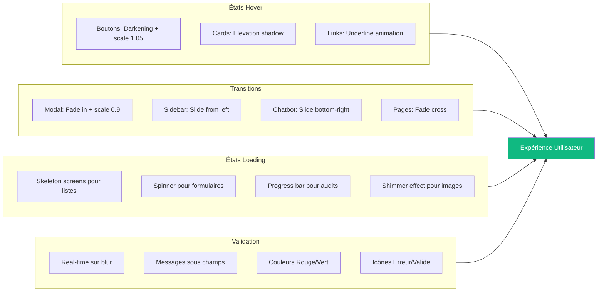

---

## Notes d'Implémentation

**Pour générer les diagrammes:**
1. Copier un bloc Mermaid
2. Coller dans https://mermaid.live
3. Exporter en PNG/SVG

**Types de diagrammes utilisés:**
- `graph TB/LR` - Organigrammes directionnels
- `stateDiagram-v2` - Machines à états
- `sequenceDiagram` - Diagrammes de séquence

**Avantages Mermaid vs ASCII:**
- ✅ Rendu visuel professionnel
- ✅ Export PNG/SVG/PDF
- ✅ Intégration Markdown
- ✅ Éditable et versionnable
- ✅ Animations possibles

**Référence complète:**
- Wireframes ASCII détaillés: `Wireframes.md`
- Wireframes Mermaid interactifs: `Wireframes-Mermaid.md` (ce fichier)
